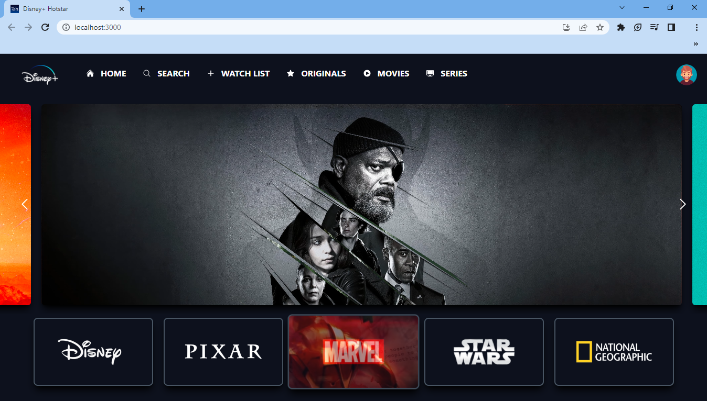

### Credit: [https://www.youtube.com/@tubeguruji](https://youtu.be/3NHYl0Lo74A)

# Disney+ Clone with React and Tailwind CSS




This project is a Full Stack Disney+ clone built using React.js and Tailwind CSS. It allows users to browse trending movies and discover movies by genre using data from the [The Movie Database (TMDb) API](https://www.themoviedb.org/). The application provides a user-friendly interface similar to the Disney+ streaming platform.

## Table of Contents

- [Demo](#demo)
- [Features](#features)
- [Installation](#installation)
- [Usage](#usage)
- [Technologies Used](#technologies-used)
- [API Usage](#api-usage)
- [Contributing](#contributing)

## Demo

Provide a link to a live demo of your application if available.

## Features

- Browse trending movies and TV shows.
- Discover movies by genre.
- Responsive design for various screen sizes.
- User-friendly interface inspired by Disney+.

## Installation

1. Clone the repository:

```bash
git clone https://github.com/G-nizam-A/Disney-Plus-Hotstar-Clone.git

2. Navigate to the project directory:

```bash
cd disney-plus-hotstar-clone

3. Install dependencies:

```bash
npm install

## Usage

1. Get an API key from The Movie Database (TMDb) by signing up for an account.
2. Add your API key to GlobalApi.js file
3. Run the development server:

```bash
npm start

4. Open your web browser and navigate to http://localhost:3000 to view the application.

## Technologies Used

- React.js
- Tailwind CSS
- Axios

## API Usage
The application uses the [Movie Database (TMDb) API](https://www.themoviedb.org/) to fetch movie data. The API requests are handled using the provided api.js module. Trending movies and movies by genre can be accessed through the following methods:

Remember to replace 'your-api-key' with your actual TMDb API key in GlobalApi.js file.

Contributing
Contributions are welcome! If you'd like to contribute to this project.


